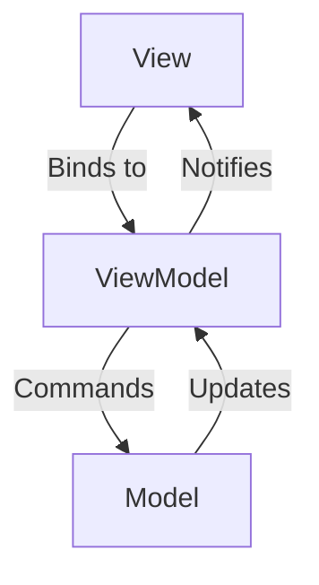

# MVVM Framework Detailed Guide

## 1. Binding Modes Explanation

### OneWay Binding
- Data flows **from ViewModel to View only**
- View updates when ViewModel properties change
- Implemented through `PropertyChanged` notifications
- Example: Display-only text fields

### TwoWay Binding 
- Data flows **both directions** between View and ViewModel
- View updates ViewModel, ViewModel updates View
- Uses `DataContext` synchronization in `view_sync_data_context.h`
- Example: Editable form fields

### Key Differences
| Feature        | OneWay | TwoWay |
|---------------|--------|--------|
| Data Flow     | VM→V   | VM↔V   |
| Performance   | Faster | Slightly slower |
| Use Case      | Read-only | Editable |

## 2. Framework Architecture



## 3. Core Components

### Macros Reference

#### Property Macros
| Macro | Description | Example | Usage |
|-------|-------------|---------|-------|
| `DEFINE_PROPERTY` | 标准属性定义(public get/set) | `DEFINE_PROPERTY(int, Count, 0)` | 常规属性 |
| `DEFINE_PROPERTY_PRIVATE_SET` | 私有setter属性 | `DEFINE_PROPERTY_PRIVATE_SET(int, Id, -1)` | 只允许类内部修改 |
| `DEFINE_PROPERTY_PROTECTED_SET` | 保护setter属性 | `DEFINE_PROPERTY_PROTECTED_SET(string, Name, "")` | 允许派生类修改 |
| `DEFINE_PROPERTY_READONLY` | 只读属性 | `DEFINE_PROPERTY_READONLY(Guid, SessionId, {})` | 只读数据 |

#### Callback Property Macros
| Macro | Description | Example | Usage |
|-------|-------------|---------|-------|
| `DEFINE_PROPERTY_CALLBACK` | 带变更回调的属性 | `DEFINE_PROPERTY_CALLBACK(float, Price, 0.0f)` | 需要响应属性变化 |
| `DEFINE_PROPERTY_CALLBACK_PRIVATE_SET` | 私有setter回调属性 | `DEFINE_PROPERTY_CALLBACK_PRIVATE_SET(string, Token, "")` | 限制外部修改 |
| `DEFINE_PROPERTY_CALLBACK_PROTECTED_SET` | 保护setter回调属性 | `DEFINE_PROPERTY_CALLBACK_PROTECTED_SET(bool, Enabled, false)` | 允许派生类修改 |
| `DEFINE_PROPERTY_CALLBACK_NO_NOTIFY` | 无通知回调属性 | `DEFINE_PROPERTY_CALLBACK_NO_NOTIFY(int, InternalState, 0)` | 内部状态变化处理 |

#### Notification Control Macros
| Macro | Description | Example | Usage |
|-------|-------------|---------|-------|
| `DEFINE_PROPERTY_NO_NOTIFY` | 无通知属性 | `DEFINE_PROPERTY_NO_NOTIFY(bool, IsDirty, false)` | 内部状态管理 |
| `DEFINE_PROPERTY_NO_COMPARE` | 强制通知属性 | `DEFINE_PROPERTY_NO_COMPARE(time_point, Updated, {})` | 需要总是刷新UI |
| `DEFINE_PROPERTY_NO_NOTIFY_PRIVATE_SET` | 私有setter无通知属性 | `DEFINE_PROPERTY_NO_NOTIFY_PRIVATE_SET(int, Counter, 0)` | 内部计数器 |
| `DEFINE_PROPERTY_NO_NOTIFY_PROTECTED_SET` | 保护setter无通知属性 | `DEFINE_PROPERTY_NO_NOTIFY_PROTECTED_SET(float, Ratio, 1.0f)` | 派生类内部使用 |

**Callback Implementation Example:**
```cpp
// Header
class ProductVM : public view_model_base<ProductVM> {
public:
    DEFINE_PROPERTY_CALLBACK(double, Price, 0.0);
protected:
    void OnPriceChanged(double const& oldValue, double const& newValue);
};

// Implementation
void ProductVM::OnPriceChanged(double const& oldValue, double const& newValue) {
    // Recalculate dependent properties
    UpdateDiscount();
    UpdateTax();
}
```

**Callback vs Standard Property:**
1. 回调属性会在值变更时自动调用对应的OnXxxChanged方法
2. 适合需要联动更新其他属性的场景
3. 回调方法可以访问旧值和新值
4. 标准属性更适合简单独立属性

#### Event Macros
| Macro | Description | Example | Usage |
|-------|-------------|---------|-------|
| `DEFINE_EVENT` | 定义事件 | `DEFINE_EVENT(RoutedEventHandler, Click)` | UI事件处理 |

#### Name Macros
| Macro | Description | Example | Usage |
|-------|-------------|---------|-------|
| `NAME_OF` | 获取属性名的wstring_view | `NAME_OF(MyVM, Count)` | 属性变更通知 |
| `NAME_OF_NARROW` | 获取属性名的string_view | `NAME_OF_NARROW(MyVM, Name)` | 窄字符场景 |

**Best Practices:**
1. 优先使用`NAME_OF`而非字符串字面量
2. 简单属性使用`DEFINE_PROPERTY`系列
3. 需要响应变化时使用`DEFINE_PROPERTY_CALLBACK`
4. 内部状态使用`DEFINE_PROPERTY_NO_NOTIFY`

### Notification System
- Implemented in `notify_property_changed.h`
- Uses `INotifyPropertyChanged` interface
- Multiple notification strategies with different use cases:

#### Standard Notification (Recommended)
```cpp
// 1. Compares old/new values
// 2. Only notifies if value changed
set_property(value, "PropertyName");
```
- **Use when**: Normal property updates
- **Benefits**: 
  - Avoids unnecessary UI updates
  - Better performance
- **Example**: 
```cpp
void SetName(string newName) {
    set_property(m_name, newName, NAME_OF(MyVM, Name));
}
```

#### Force Notification
```cpp 
// 1. Skips value comparison
// 2. Always notifies UI
set_property_no_compare(value, "PropertyName");
```
- **Use when**:
  - Property has custom equality logic
  - Need to force UI refresh
  - Calculated properties
- **Example**:
```cpp
void RefreshAll() {
    set_property_no_compare(m_data, NAME_OF(MyVM, Data));
}
```

#### Silent Update  
```cpp
// 1. Updates value 
// 2. Never notifies UI
set_property_no_notify(value);
```
- **Use when**:
  - Internal state changes
  - Batch updates (notify manually later)
  - Performance-critical sections
- **Example**:
```cpp
void LoadData() {
    set_property_no_notify(m_loading, true); // No UI notify
    //...load data
    set_property(m_loading, false); // Final notify
}
```

#### Performance Considerations
| Method                | Comparison | Notification | Use Case               |
|-----------------------|------------|--------------|------------------------|
| set_property          | Yes        | Conditional  | Default case           |
| set_property_no_compare| No        | Always       | Force refresh          |
| set_property_no_notify | No        | Never        | Internal updates       |

### TwoWay Binding Implementation
- Synchronizes `DataContext` and `ViewModel` properties
- Recursion protection mechanism
- Example flow:
  1. View edit → ViewModel update
  2. ViewModel → PropertyChanged event
  3. View updates UI

## 4. Usage Examples

### TwoWay Binding Additional Requirements
- View必须继承自`view_sync_data_context`以启用双向同步
- 需要在XAML中显式指定`Mode=TwoWay`
- ViewModel属性必须实现完整的getter/setter

### Complete Minimal Examples

#### OneWay Binding Example
**ViewModel:**
```cpp
// OneWayViewModel.h
class OneWayViewModel : public view_model_base<OneWayViewModel> {
    std::wstring m_message;
public:
    std::wstring Message() { return get_property(m_message); }
    void Message(std::wstring value) { 
        set_property(m_message, value, NAME_OF(OneWayViewModel, Message));
    }
};
```

**View XAML:**
```xml
<Page x:Class="MyApp.OneWayView"
      xmlns="http://schemas.microsoft.com/winfx/2006/xaml/presentation"
      xmlns:x="http://schemas.microsoft.com/winfx/2006/xaml">
    <TextBlock Text="{x:Bind ViewModel.Message, Mode=OneWay}"/>
</Page>
```

#### TwoWay Binding Example
**ViewModel:**
```cpp
// TwoWayViewModel.h
class TwoWayViewModel : public view_model_base<TwoWayViewModel> {
    std::wstring m_input;
public:
    std::wstring Input() { return get_property(m_input); }
    void Input(std::wstring value) { 
        set_property(m_input, value, NAME_OF(TwoWayViewModel, Input));
    }
};
```

**View XAML:**
```xml
<Page x:Class="MyApp.TwoWayView"
      xmlns="http://schemas.microsoft.com/winfx/2006/xaml/presentation"
      xmlns:x="http://schemas.microsoft.com/winfx/2006/xaml">
    <TextBox Text="{x:Bind ViewModel.Input, Mode=TwoWay}"/>
</Page>
```

**View C++ (关键部分):**
```cpp
// TwoWayView.h
class TwoWayView : public PageT<TwoWayView>,
                   public view_sync_data_context<TwoWayView, TwoWayViewModel> {
public:
    TwoWayView() {
        InitializeComponent();
        ViewModel(TwoWayViewModel{}); // 初始化ViewModel
    }
};
```

## 5. Best Practices

1. Use TwoWay binding sparingly - only for editable fields
2. Prefer `NAME_OF` macro for property names
3. Group related property notifications
4. Consider thread safety when using dispatcher
5. Use commands for UI actions
