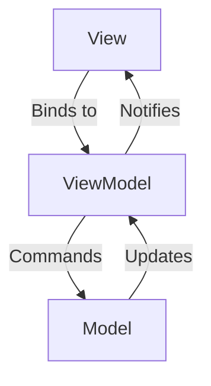

# MVVM 框架详解指南

## 1. 绑定模式说明

### OneWay（单向）绑定
- 数据仅从 ViewModel 流向 View
- 当 ViewModel 属性变化时，View 自动更新
- 通过 `PropertyChanged` 通知实现
- 适用示例：只读显示类文本

### TwoWay（双向）绑定
- 数据在 View 与 ViewModel 之间双向流动
- View 更新 ViewModel；ViewModel 更新 View
- 在 `view_sync_data_context.h` 中利用 `DataContext` 同步
- 适用示例：可编辑的表单字段

### 关键差异
| 特性            | 单向 | 双向 |
|-----------------|------|------|
| 数据流          | VM→V | VM↔V |
| 性能            | 更快 | 略慢 |
| 使用场景        | 只读 | 可编辑 |

## 2. 框架架构



## 3. 核心组件

### 宏参考

#### 属性宏
| 宏 | 描述 | 示例 | 用途 |
|----|------|------|------|
| `DEFINE_PROPERTY` | 标准属性定义（公有 get/set） | `DEFINE_PROPERTY(int, Count, 0)` | 常规属性 |
| `DEFINE_PROPERTY_PRIVATE_SET` | 私有 setter 属性 | `DEFINE_PROPERTY_PRIVATE_SET(int, Id, -1)` | 仅类内部可改 |
| `DEFINE_PROPERTY_PROTECTED_SET` | 受保护 setter 属性 | `DEFINE_PROPERTY_PROTECTED_SET(string, Name, "")` | 允许派生类修改 |
| `DEFINE_PROPERTY_READONLY` | 只读属性 | `DEFINE_PROPERTY_READONLY(Guid, SessionId, {})` | 只读数据 |

#### 带回调的属性宏
| 宏 | 描述 | 示例 | 用途 |
|----|------|------|------|
| `DEFINE_PROPERTY_CALLBACK` | 带变更回调的属性 | `DEFINE_PROPERTY_CALLBACK(float, Price, 0.0f)` | 需要响应属性变化 |
| `DEFINE_PROPERTY_CALLBACK_PRIVATE_SET` | 私有 setter 回调属性 | `DEFINE_PROPERTY_CALLBACK_PRIVATE_SET(string, Token, "")` | 限制外部修改 |
| `DEFINE_PROPERTY_CALLBACK_PROTECTED_SET` | 受保护 setter 回调属性 | `DEFINE_PROPERTY_CALLBACK_PROTECTED_SET(bool, Enabled, false)` | 允许派生类修改 |
| `DEFINE_PROPERTY_CALLBACK_NO_NOTIFY` | 无通知回调属性 | `DEFINE_PROPERTY_CALLBACK_NO_NOTIFY(int, InternalState, 0)` | 内部状态变化处理 |

**回调实现示例：**
```cpp
// 头文件
class ProductVM : public view_model_base<ProductVM> {
public:
    DEFINE_PROPERTY_CALLBACK(double, Price, 0.0);
protected:
    void OnPriceChanged(double const& oldValue, double const& newValue);
};

// 实现文件
void ProductVM::OnPriceChanged(double const& oldValue, double const& newValue) {
    // 重新计算依赖属性
    UpdateDiscount();
    UpdateTax();
}
```

**回调属性 vs 标准属性：**
1. 回调属性在值变更时会自动调用对应的 OnXxxChanged 方法
2. 适合需要联动更新其他属性的场景
3. 回调方法可同时访问旧值与新值
4. 标准属性更适合简单、互不依赖的属性

#### 事件宏
| 宏 | 描述 | 示例 | 用途 |
|----|------|------|------|
| `DEFINE_EVENT` | 定义事件 | `DEFINE_EVENT(RoutedEventHandler, Click)` | UI 事件处理 |

#### 名称宏
| 宏 | 描述 | 示例 | 用途 |
|----|------|------|------|
| `NAME_OF` | 获取属性名的 wstring_view | `NAME_OF(MyVM, Count)` | 属性变更通知 |
| `NAME_OF_NARROW` | 获取属性名的 string_view | `NAME_OF_NARROW(MyVM, Name)` | 窄字符场景 |

**最佳实践：**
1. 优先使用 `NAME_OF` 而非字符串字面量
2. 简单属性使用 `DEFINE_PROPERTY` 系列
3. 需要响应变化时使用 `DEFINE_PROPERTY_CALLBACK`
4. 内部状态使用 `DEFINE_PROPERTY_NO_NOTIFY`

### 通知系统
- 实现在 `notify_property_changed.h`
- 采用 `INotifyPropertyChanged` 接口
- 提供多种通知策略，适配不同使用场景：

#### 标准通知（推荐）
```cpp
// 1. 比较旧/新值
// 2. 仅在值变更时通知
set_property(value, "PropertyName");
```
- 适用场景：常规属性更新
- 优点：
  - 避免不必要的 UI 刷新
  - 更好的性能
- 示例：
```cpp
void SetName(string newName) {
    set_property(m_name, newName, NAME_OF(MyVM, Name));
}
```

#### 强制通知
```cpp
// 1. 跳过值比较
// 2. 始终通知 UI
set_property_no_compare(value, "PropertyName");
```
- 适用场景：
  - 属性具有自定义等价逻辑
  - 需要强制刷新 UI
  - 计算型属性
- 示例：
```cpp
void RefreshAll() {
    set_property_no_compare(m_data, NAME_OF(MyVM, Data));
}
```

#### 静默更新
```cpp
// 1. 更新值
// 2. 从不通知 UI
set_property_no_notify(value);
```
- 适用场景：
  - 内部状态变更
  - 批量更新（稍后手动通知）
  - 性能敏感区段
- 示例：
```cpp
void LoadData() {
    set_property_no_notify(m_loading, true); // 不通知 UI
    //...load data
    set_property(m_loading, false); // 最终通知
}
```

#### 性能考量
| 方法                   | 是否比较 | 是否通知 | 主要用途           |
|------------------------|----------|----------|--------------------|
| set_property           | 是       | 视情况   | 默认用例           |
| set_property_no_compare| 否       | 总是     | 强制刷新           |
| set_property_no_notify | 否       | 从不     | 内部更新           |

### 双向绑定实现
- 同步 `DataContext` 与 `ViewModel` 属性
- 具备递归保护机制
- 示例流程：
  1. View 编辑 → 更新 ViewModel
  2. ViewModel 触发 PropertyChanged
  3. View 更新 UI

## 4. 使用示例

### 双向绑定的附加要求
- View 必须继承自 `view_sync_data_context` 以启用双向同步
- 需要在 XAML 中显式指定 `Mode=TwoWay`
- ViewModel 属性需实现完整的 getter/setter

### 最小完整示例

#### 单向绑定示例
**ViewModel：**
```cpp
// OneWayViewModel.h
class OneWayViewModel : public view_model_base<OneWayViewModel> {
    std::wstring m_message;
public:
    std::wstring Message() { return get_property(m_message); }
    void Message(std::wstring value) { 
        set_property(m_message, value, NAME_OF(OneWayViewModel, Message));
    }
};
```

**View XAML：**
```xml
<Page x:Class="MyApp.OneWayView"
      xmlns="http://schemas.microsoft.com/winfx/2006/xaml/presentation"
      xmlns:x="http://schemas.microsoft.com/winfx/2006/xaml">
    <TextBlock Text="{x:Bind ViewModel.Message, Mode=OneWay}"/>
</Page>
```

#### 双向绑定示例
**ViewModel：**
```cpp
// TwoWayViewModel.h
class TwoWayViewModel : public view_model_base<TwoWayViewModel> {
    std::wstring m_input;
public:
    std::wstring Input() { return get_property(m_input); }
    void Input(std::wstring value) { 
        set_property(m_input, value, NAME_OF(TwoWayViewModel, Input));
    }
};
```

**View XAML：**
```xml
<Page x:Class="MyApp.TwoWayView"
      xmlns="http://schemas.microsoft.com/winfx/2006/xaml/presentation"
      xmlns:x="http://schemas.microsoft.com/winfx/2006/xaml">
    <TextBox Text="{x:Bind ViewModel.Input, Mode=TwoWay}"/>
</Page>
```

**View C++（关键部分）：**
```cpp
// TwoWayView.h
class TwoWayView : public PageT<TwoWayView>,
                   public view_sync_data_context<TwoWayView, TwoWayViewModel> {
public:
    TwoWayView() {
        InitializeComponent();
        ViewModel(TwoWayViewModel{}); // 初始化 ViewModel
    }
};
```

## 5. 最佳实践

1. 谨慎使用双向绑定，仅用于可编辑字段
2. 优先使用 `NAME_OF` 宏获取属性名
3. 将相关属性通知合并触发
4. 使用调度器时注意线程安全
5. UI 行为使用命令进行抽象
